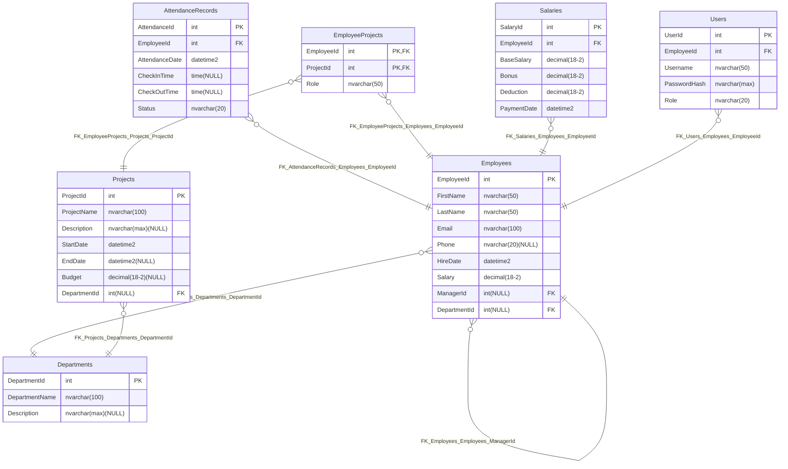

# 🏢 Company Management System

## 📖 Project Overview
The **Company Management System** is designed to manage employees, departments, projects, salaries, and attendance records within an organization. This system provides structured data management, ensuring efficient tracking of employee activities and organizational operations.

## 👥 Authors
- **Amir Sajjad Hosein Pour**  
- **Alireza Rostami**  

## 🛠️ Technologies Used
- **ASP.NET 8** (Web API & MVC)
- **Entity Framework Core** (Code-First Approach)
- **SQL Server** (Database)
- **C#** (Backend Development)
- **Mermaid.js** (ER Diagram Visualization)

## 📌 Features
✅ **Employee Management** - Add, edit, delete, and view employee details.  
✅ **Department Management** - Manage departments and their employees.  
✅ **Project Assignment** - Assign employees to projects and define roles.  
✅ **Attendance Tracking** - Track employee attendance with check-in/check-out times.  
✅ **Salary Management** - Manage employee salaries, bonuses, and deductions.  
✅ **User Authentication** - Secure login system with roles and hashed passwords.  

## Relationship Details

### 1️⃣ One-to-Many (1:N) Relationships
- Employees → Departments (`1 Department` has `N Employees`)
  - Each employee belongs to one department, but a department can have multiple employees.
- Employees → AttendanceRecords (`1 Employee` has `N AttendanceRecords`)
  - Each attendance record is linked to one employee, but an employee can have multiple attendance records over time.
- Employees → Salaries (`1 Employee` has `N Salaries`)
  - Employees receive multiple salary payments over time.
- Projects → Departments (`1 Department` has `N Projects`)
  - Each project is managed by one department, but a department can have multiple projects.

### 2️⃣ One-to-One (1:1) Relationships
- Employees → Users (`1 Employee` has `1 User account`)
  - Each employee has a corresponding system user account.

### 3️⃣ Many-to-Many (M:N) Relationships
- Employees ↔ EmployeeProjects ↔ Projects
  - An employee can be assigned to multiple projects.
  - A project can have multiple employees working on it.
  - This is handled through the **EmployeeProjects** junction table.
- Employees → Employees (Self-Referencing)
  - Each employee can have a **manager**, meaning an employee can supervise other employees in a hierarchical structure.

---

### Summary Table

Below is the entity-relationship diagram (ERD) for our database schema:



## 🏗️ How to Run the Project
### 📌 **Prerequisites**
1. **Visual Studio 2022** (or later)  
2. **SQL Server 2019+**  
3. **.NET 8 SDK**  
4. **Entity Framework Core CLI**  

### 🚀 **Installation Steps**
1️⃣ Clone the repository:  
   ```sh
   git clone https://github.com/Crisiroid/CompanyManagementSystem.git
   cd ComanyManagementSystem
   ```

2️⃣ Restore dependencies:  
   ```sh
   dotnet restore
   ```

3️⃣ Apply database migrations:  
   ```sh
   dotnet ef database update
   ```

4️⃣ Run the project:  
   ```sh
   dotnet run
   ```

## 🔒 User Roles
| Role        | Description |
|-------------|------------|
| **Admin**   | Full access to the system |
| **Manager** | Can manage employees and projects |
| **Employee**| Can view personal data and attendance |

## 📜 License
This project is **open-source** under the **MIT License**.

---

### 🎯 **Contributions & Feedback**
We welcome contributions! Feel free to submit issues and pull requests.  
For any feedback, contact **Amir Sajjad Hosein Pour** or **Alireza Rostami**.  

